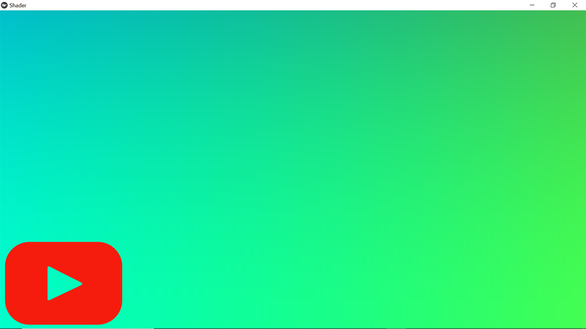
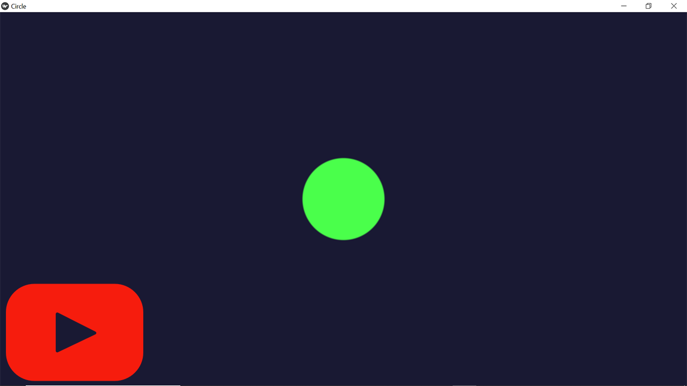
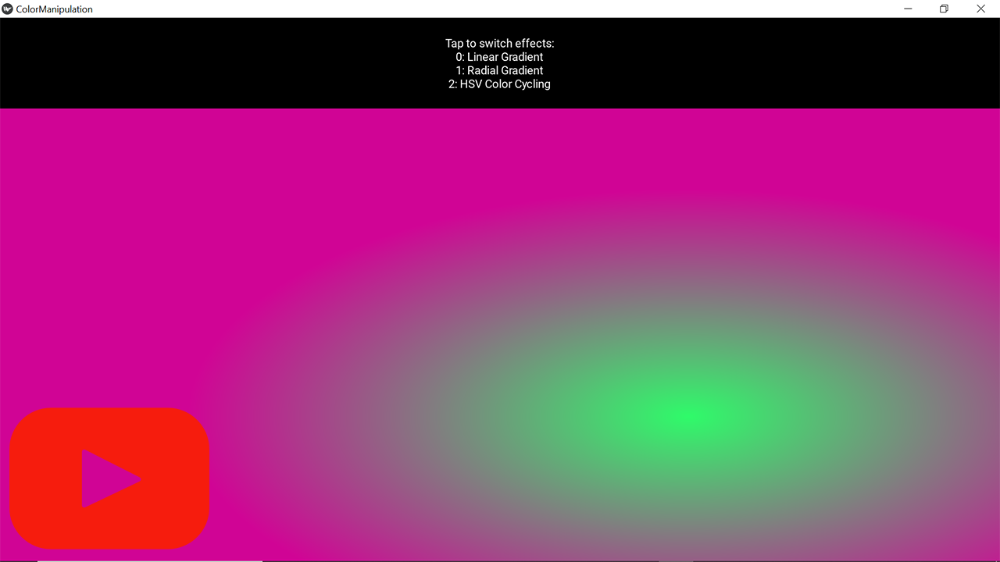
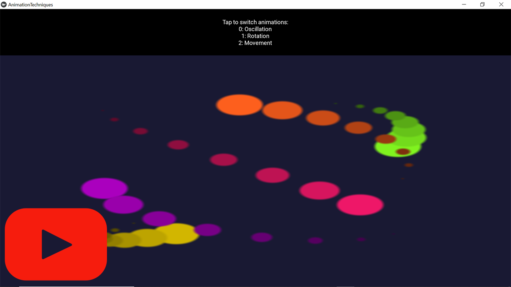
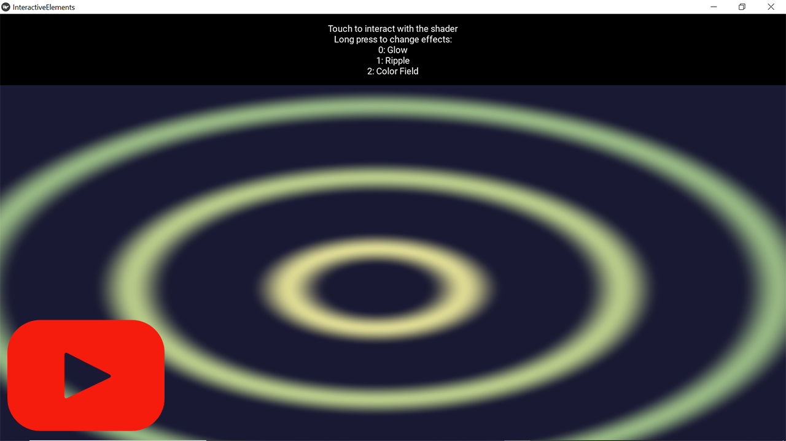
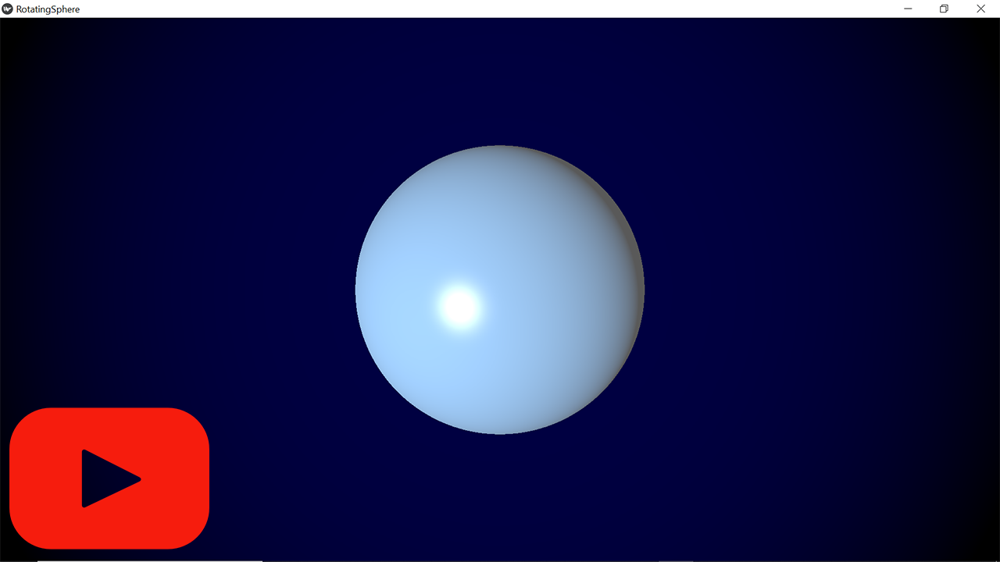
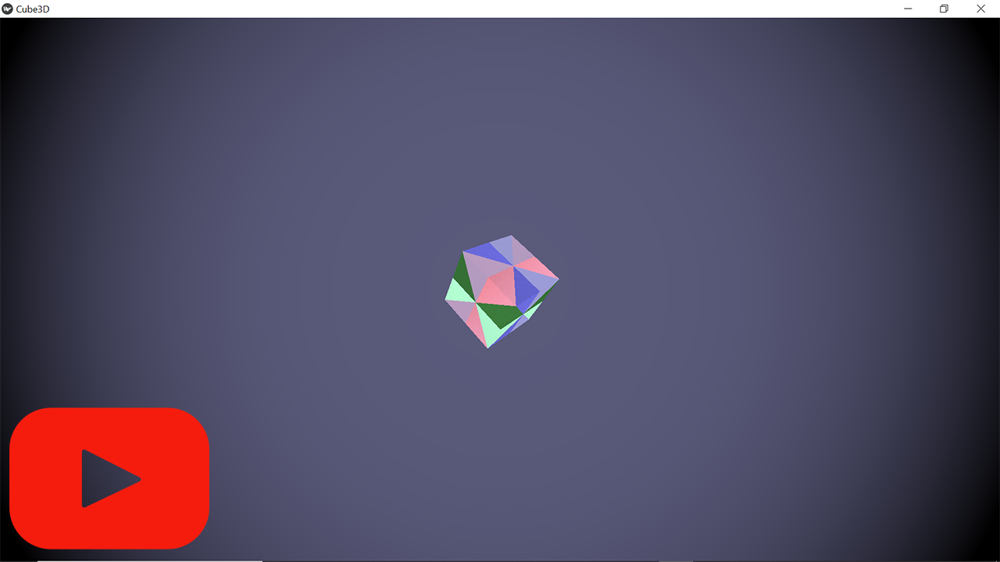
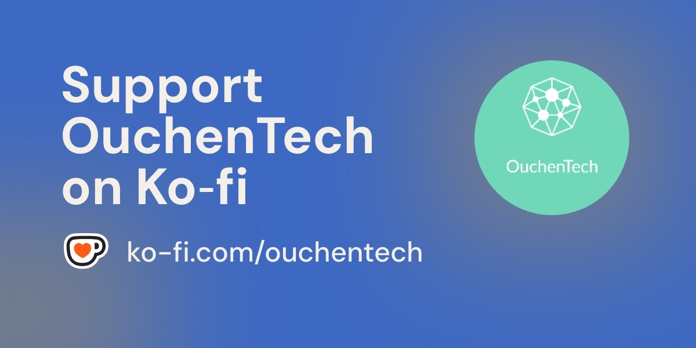

# Shaders in Kivy: From Basics to 3D with GLSL

## Table of Contents

1. [Introduction to GLSL in Kivy](#introduction-to-glsl-in-kivy)
2. [Quick Start Example](#quick-start-example)
3. [GLSL Fundamentals in Kivy](#glsl-fundamentals-in-kivy)
4. [Data Communication](#data-communication)
5. [Essential Techniques](#essential-techniques)
6. [Advanced Rendering](#advanced-rendering)
7. [3D Rendering with GLSL](#3d-rendering-with-glsl)

## Introduction to GLSL in Kivy

### What is GLSL?

GLSL (OpenGL Shading Language) is a high-level shading language that allows you to write programs (shaders) that run directly on the GPU. This makes it ideal for creating complex visual effects, 3D rendering, and animations that would be too computationally intensive for the CPU alone.

### Why Use GLSL in Kivy?

- **Performance**: GPU-accelerated graphics for smooth animations and effects
- **Visual Effects**: Create complex visual effects that would be difficult with traditional drawing methods
- **Custom Rendering**: Full control over the rendering pipeline
- **Hardware Acceleration**: Leverage modern GPU capabilities

### When to Use Shaders vs. Other Kivy Approaches

| Approach | Best For | Limitations |
|----------|----------|-------------|
| Canvas Instructions | Simple graphics, UI elements | Limited visual effects, less flexibility than shaders |
| Kivy Effects | Pre-defined effects, simple modifications | Limited customization |
| GLSL Shaders | Custom effects, animations, 3D rendering | Steeper learning curve |

## Quick Start Example

Let's create a simple shader that displays a gradient color with animation.

### Step 1: Create Your GLSL File

Create a file named `simple_shader.glsl`:

```glsl
---VERTEX SHADER---
$HEADER$

// Pass texture coordinates to fragment shader
varying vec2 v_tex_coord;

void main() {
    // Pass texture coordinates to fragment shader
    v_tex_coord = vTexCoords0;
    
    // Standard position calculation
    gl_Position = projection_mat * modelview_mat * vec4(vPosition, 0.0, 1.0);
}

---FRAGMENT SHADER---
$HEADER$

// Receive texture coordinates from vertex shader
varying vec2 v_tex_coord;

// Define uniforms
uniform float time;

void main() {
    // Create animated gradient
    vec3 color = 0.5 + 0.5 * cos(time + v_tex_coord.xyx + vec3(0, 2, 4));
    
    // Output color
    gl_FragColor = vec4(color, 1.0);
}
```

### Step 2: Create Your Kivy Application

Create a file named `shader_app.py`:

```python
from kivy.app import App
from kivy.uix.widget import Widget
from kivy.graphics import RenderContext, Rectangle
from kivy.clock import Clock
from kivy.properties import NumericProperty

class ShaderWidget(Widget):
    time = NumericProperty(0)
    
    def __init__(self, **kwargs):
        super().__init__(**kwargs)
        # Create a render context with shader
        self.canvas = RenderContext(use_parent_projection=True)
        self.canvas.shader.source = 'simple_shader.glsl'
        
        # Create a rectangle that fills the widget
        with self.canvas:
            self._rect = Rectangle(pos=self.pos, size=self.size)
        
        # Bind widget properties to update methods
        self.bind(
            pos=self.update_rect,
            size=self.update_rect
        )
        
        # Schedule time updates
        Clock.schedule_interval(self.update_time, 1/60.)
    
    def update_rect(self, *args):
        # Update rectangle position and size
        self._rect.pos = self.pos
        self._rect.size = self.size
    
    def update_time(self, dt):
        # Increment time and update shader
        self.time += dt
        self.canvas['time'] = self.time

class ShaderApp(App):
    def build(self):
        return ShaderWidget()

if __name__ == '__main__':
    ShaderApp().run()
```

### Step 3: Run Your Application

```bash
python shader_app.py
```

You should see a colorful animated gradient! This simple example demonstrates the basic structure of using GLSL in Kivy.

[](https://youtu.be/Yl8OoJrm3Rw?t=7s)

## GLSL Fundamentals in Kivy

Before diving into effects, let’s establish how GLSL integrates with Kivy. While Kivy’s standard rendering already leverages the GPU via OpenGL, GLSL shaders allow direct control over the GPU’s programmable pipeline. This unlocks advanced visual effects and fine-grained rendering techniques not possible with high-level canvas instructions. This section covers the building blocks: shader structure, data types, and coordinate systems. Think of it as learning the 'grammar' of GPU programming—essential for everything that follows.

### Shader Structure in Kivy

Kivy GLSL files consist of two main parts:

1. **Vertex Shader**: Processes vertices (points in space) and determines their positions
2. **Fragment Shader**: Processes pixels and determines their colors

```glsl
---VERTEX SHADER---
$HEADER$
// Vertex shader code here

void main() {
    // Main function for vertex processing
}

---FRAGMENT SHADER---
$HEADER$
// Fragment shader code here

void main() {
    // Main function for fragment (pixel) processing
}
```

### Understanding the $HEADER$ Directive

The `$HEADER$` is a Kivy-specific preprocessor directive that automatically includes necessary GLSL variables and configurations. It inserts:

- **Attributes**: `vPosition`, `vTexCoords0`, `vColor`
- **Uniforms**: `projection_mat`, `modelview_mat`, `texture0`
- **Version directives**: Proper GLSL version header for the current platform

This saves you from having to manually declare these common variables in every shader. Always include `$HEADER$` at the beginning of both your vertex and fragment shaders.

**Important Note**: The `$HEADER$` includes only built-in variables - you must still declare your custom uniforms like `time` and `resolution` explicitly in your shader code.

### Basic Data Types and Operations

GLSL supports several fundamental data types:

#### Scalar Types
- `float`: Floating-point number (e.g., `float x = 1.0;`) - must include decimal point
- `int`: Integer (e.g., `int i = 42;`)
- `bool`: Boolean (e.g., `bool flag = true;`)

#### Vector Types
- `vec2`: 2-component vector (e.g., `vec2 pos = vec2(0.5, 0.5);`)
- `vec3`: 3-component vector (e.g., `vec3 color = vec3(1.0, 0.0, 0.0);`)
- `vec4`: 4-component vector (e.g., `vec4 rgba = vec4(1.0, 0.5, 0.0, 1.0);`)

There are also integer vectors (`ivec2`, `ivec3`, `ivec4`) and boolean vectors (`bvec2`, `bvec3`, `bvec4`).

#### Matrix Types
- `mat2`: 2×2 matrix
- `mat3`: 3×3 matrix
- `mat4`: 4×4 matrix (e.g., `mat4 transform = mat4(1.0);`)

#### Vector Operations

```glsl
vec3 a = vec3(1.0, 2.0, 3.0);
vec3 b = vec3(4.0, 5.0, 6.0);

vec3 sum = a + b;          // Vector addition
vec3 diff = a - b;         // Vector subtraction
vec3 scalarMult = a * 2.0; // Scalar multiplication
vec3 compMult = a * b;     // Component-wise multiplication
float dotProduct = dot(a, b);  // Dot product
vec3 crossProduct = cross(a, b); // Cross product (for vec3 only)
float length = length(a);  // Vector length
vec3 normalized = normalize(a); // Normalized vector
```

#### Swizzling

GLSL allows you to access and reorder vector components easily:

```glsl
vec4 color = vec4(1.0, 0.5, 0.25, 1.0);

// Access individual components
float red = color.r;    // 1.0 (same as color.x)
float green = color.g;  // 0.5 (same as color.y)
float blue = color.b;   // 0.25 (same as color.z)
float alpha = color.a;  // 1.0 (same as color.w)

// Create new vectors by swizzling
vec3 rgb = color.rgb;  // vec3(1.0, 0.5, 0.25)
vec3 bgr = color.bgr;  // vec3(0.25, 0.5, 1.0)
vec2 rg = color.rg;    // vec2(1.0, 0.5)

// You can even repeat components
vec3 rrr = color.rrr;  // vec3(1.0, 1.0, 1.0)
vec4 xyxy = color.xyxy; // vec4(1.0, 0.5, 1.0, 0.5)
```

### Built-in GLSL Variables

GLSL provides several built-in variables that serve special purposes:

#### Vertex Shader Built-ins
- `gl_Position`: Output variable for the final vertex position (required)
- `gl_PointSize`: Sets the size of points when rendering point primitives

#### Fragment Shader Built-ins
- `gl_FragColor`: Output variable for the final fragment color (required)
- `gl_FragCoord`: Contains the window-relative coordinates of the current fragment
- `gl_FrontFacing`: Boolean indicating if the fragment belongs to a front-facing primitive
- `gl_PointCoord`: The coordinates within a point primitive (0,0 to 1,1)

### Coordinate Systems and Conversions

Understanding coordinate systems is crucial when working with GLSL in Kivy:

#### Kivy's Texture Coordinates

In the fragment shader, you receive interpolated texture coordinates (`v_tex_coord`) from the vertex shader:

- Bottom-left corner: `(0.0, 0.0)`
- Top-right corner: `(1.0, 1.0)`

#### Normalized Device Coordinates (NDC)

OpenGL's internal coordinate system:

- Bottom-left corner: `(-1.0, -1.0)`
- Top-right corner: `(1.0, 1.0)`

#### Converting Between Coordinate Systems

```glsl
// Convert texture coordinates to centered coordinates (-1 to 1)
vec2 centered = (v_tex_coord * 2.0 - 1.0);

// Apply aspect ratio correction
float aspect = resolution.x / resolution.y;
vec2 uv = centered * vec2(aspect, 1.0);

// Example: Calculate distance from center (useful for radial effects)
float dist = length(centered);
```

### Common Mathematical Functions

GLSL provides a rich set of mathematical functions:

#### Trigonometric Functions
- `sin(x)`, `cos(x)`, `tan(x)`: Standard trigonometric functions
- `asin(x)`, `acos(x)`, `atan(x)`: Inverse trigonometric functions

#### Exponential Functions
- `pow(x, y)`: x raised to the power of y
- `exp(x)`: e raised to the power of x
- `log(x)`: Natural logarithm of x
- `sqrt(x)`: Square root of x

#### Common Operations
- `abs(x)`: Absolute value
- `floor(x)`: Largest integer not greater than x
- `ceil(x)`: Smallest integer not less than x
- `fract(x)`: Fractional part of x (x - floor(x))
- `mod(x, y)`: Modulo operation (x - y * floor(x/y))
- `min(x, y)`: Minimum of x and y
- `max(x, y)`: Maximum of x and y
- `clamp(x, min, max)`: Constrains x to the range [min, max]
- `mix(x, y, a)`: Linear interpolation between x and y based on a
- `step(edge, x)`: 0.0 if x < edge, otherwise 1.0
- `smoothstep(edge0, edge1, x)`: Smooth transition between 0 and 1

```glsl
// Example: Creating a smooth circular gradient
float dist = length(v_tex_coord - vec2(0.5, 0.5));
float circle = smoothstep(0.5, 0.45, dist);  // Soft edge circle
```

## Data Communication

Shaders become truly powerful when they respond to dynamic data. In this section, you'll learn how to bridge **Python (via Kivy)** and **GLSL**—passing data like mouse positions, timers, or textures to control shaders in real time. We’ll focus on three core communication mechanisms:

1. **Uniforms**: Send one-way data (Python → GLSL)
2. **Varyings**: Pass data between shader stages (Vertex → Fragment)
3. **Textures**: Share complex data (like images or buffers)

Master these, and your shaders will evolve from static art to interactive experiences.

### Python to Shader: Uniforms

Uniforms are special variables that remain constant for all vertices/fragments during a render pass. They're the primary way to send data from Python to your shaders.

#### Common Uniforms

`resolution`: Provides the dimensions of the rendering area, essential for maintaining aspect ratios and sizing elements properly.

`time`: Provides elapsed time for animations and time-based effects.

`mouse_pos`: Provides mouse/touch position for interactive effects.

`frame`: Provides the current frame number for frame-based animations.

#### Declaring Uniforms in GLSL

```glsl
---FRAGMENT SHADER---
$HEADER$

// Declare your uniform variables
uniform float time;        // Animation time
uniform vec2 resolution;   // Screen resolution
uniform vec2 mouse_pos;    // Mouse position
uniform sampler2D texture0; // Texture
```

#### Setting Uniforms from Python

```python
# In your Python code
def update_uniforms(self, *args):
    # Update time uniform
    self.canvas['time'] = self.time
    
    # Update resolution uniform
    self.canvas['resolution'] = [float(v) for v in self.size]
    
    # Update custom uniform
    self.canvas['my_value'] = 0.5
```

#### Custom Uniforms

Beyond these common uniforms, you can create your own for specific needs:

- **Color Controls**:
  ```glsl
  uniform vec3 primary_color;
  uniform float saturation;
  uniform float brightness;
  ```

- **Effect Parameters**:
  ```glsl
  uniform float distortion_strength;
  uniform float wave_frequency;
  uniform int effect_mode;
  ```

- **Texture Information**:
  ```glsl
  uniform sampler2D texture0;
  uniform float texture_mix;
  ```

**Setting Custom Uniforms in Kivy**:
```python
self.canvas['primary_color'] = [1.0, 0.5, 0.2]
self.canvas['wave_frequency'] = 5.0
self.canvas['effect_mode'] = 2
```

#### Common Uniform Types

| GLSL Type | Python Value |
|-----------|--------------|
| `float` | `1.0` |
| `vec2` | `[width, height]` |
| `vec3` | `[r, g, b]` |
| `vec4` | `[r, g, b, a]` |
| `int` | `1` |
| `bool` | `True` or `False` |
| `sampler2D` | Kivy texture object |

### Shader to Shader: Varying Variables

Varying variables are used to pass data from the vertex shader to the fragment shader. They are interpolated across the primitive:

```glsl
---VERTEX SHADER---
$HEADER$

// Declare varying variable
varying vec2 v_tex_coord;
varying vec3 v_normal;

void main() {
    // Assign value to varying variable
    v_tex_coord = vTexCoords0;
    v_normal = normalize(vec3(1.0, 1.0, 1.0));
    
    // Position vertex
    gl_Position = projection_mat * modelview_mat * vec4(vPosition, 0.0, 1.0);
}

---FRAGMENT SHADER---
$HEADER$

// Declare the same varying variable
varying vec2 v_tex_coord;
varying vec3 v_normal;

void main() {
    // Use the interpolated varying value
    gl_FragColor = vec4(v_tex_coord, 0.0, 1.0);
}
```
## Essential Techniques

Now for the fun part—applying theory to create real visuals. This section is a toolkit of common techniques: drawing shapes, animating colors, and responding to user input. Each example builds on the last, reinforcing core concepts while expanding your creative palette. By the end, you’ll be able to prototype effects like those in mobile apps or indie games.

### Drawing Basic Shapes

#### Circle

```glsl
float circle(vec2 uv, vec2 center, float radius) {
    float d = length(uv - center);
    return smoothstep(radius, radius - 0.01, d);
}

// Usage in fragment shader
float c = circle(v_tex_coord, vec2(0.5, 0.5), 0.3);
gl_FragColor = vec4(vec3(c), 1.0);
```

#### Rectangle

```glsl
float rectangle(vec2 uv, vec2 position, vec2 size) {
    vec2 bl = step(position, uv);
    vec2 tr = step(1.0 - position - size, 1.0 - uv);
    return bl.x * bl.y * tr.x * tr.y;
}

// Usage in fragment shader
float r = rectangle(v_tex_coord, vec2(0.3, 0.3), vec2(0.4, 0.4));
gl_FragColor = vec4(vec3(r), 1.0);
```

#### Line

```glsl
float line(vec2 uv, vec2 start, vec2 end, float thickness) {
    vec2 dir = end - start;
    float len = length(dir);
    dir = normalize(dir);
    
    vec2 point = uv - start;
    float projection = clamp(dot(point, dir), 0.0, len);
    vec2 closest = start + dir * projection;
    
    return smoothstep(thickness, thickness - 0.01, length(uv - closest));
}

// Usage in fragment shader
float l = line(v_tex_coord, vec2(0.2, 0.2), vec2(0.8, 0.8), 0.02);
gl_FragColor = vec4(vec3(l), 1.0);
```

**Example 1.1 : Let's create a Pulsing Circle with Animated Colors**

```glsl
---VERTEX SHADER---
$HEADER$
varying vec2 v_tex_coord;

void main() {
    v_tex_coord = vTexCoords0;
    gl_Position = projection_mat * modelview_mat * vec4(vPosition, 0.0, 1.0);
}

---FRAGMENT SHADER---
$HEADER$
varying vec2 v_tex_coord;
uniform vec2 resolution;
uniform float time;

// Helper function to draw a circle
float circle(vec2 uv, vec2 center, float radius) {
    float d = length(uv - center);
    return smoothstep(radius, radius - 0.01, d);
}

void main() {
    // Convert coordinates to centered UV space [-1, 1]
    vec2 uv = (v_tex_coord * 2.0 - 1.0) * vec2(resolution.x/resolution.y, 1.0);
    
    // Create a pulsing circle
    float radius = 0.3 + sin(time * 2.0) * 0.1;
    float c = circle(uv, vec2(0.0), radius);
    
    // Create animated color
    vec3 circleColor = vec3(
        0.5 + 0.5 * sin(time),
        0.5 + 0.5 * sin(time + 2.0),
        0.5 + 0.5 * sin(time + 4.0)
    );
    
    // Background color
    vec3 bgColor = vec3(0.1, 0.1, 0.2);
    
    // Mix circle and background
    vec3 color = mix(bgColor, circleColor, c);
    
    gl_FragColor = vec4(color, 1.0);
}
```

Here's the Python code to use this circle shader:

```python
from kivy.app import App
from kivy.uix.widget import Widget
from kivy.graphics import RenderContext, Rectangle
from kivy.clock import Clock
from kivy.properties import NumericProperty
from kivy.core.window import Window

class CircleWidget(Widget):
    time = NumericProperty(0)
    
    def __init__(self, **kwargs):
        super().__init__(**kwargs)
        self.canvas = RenderContext(use_parent_projection=True)
        self.canvas.shader.source = 'circle.glsl'  # Save the shader code in this file
        
        with self.canvas:
            self._rect = Rectangle(pos=self.pos, size=self.size)
        
        self.bind(
            pos=self.update_rect,
            size=self.update_rect,
            time=self.update_shader_time
        )
        
        Clock.schedule_interval(self.update_time, 1/60.)
    
    def update_rect(self, *args):
        self.canvas['projection_mat'] = Window.render_context['projection_mat']
        self.canvas['modelview_mat'] = Window.render_context['modelview_mat']
        self.canvas['resolution'] = [float(v) for v in self.size]
        
        self._rect.pos = self.pos
        self._rect.size = self.size
    
    def update_time(self, dt):
        self.time += dt
    
    def update_shader_time(self, instance, value):
        self.canvas['time'] = value

class CircleApp(App):
    def build(self):
        Window.clearcolor = (0.1, 0.1, 0.1, 1)  # Dark background
        return CircleWidget()

if __name__ == '__main__':
    CircleApp().run()
```

[](https://youtu.be/Yl8OoJrm3Rw?t=21s) 

### Color Manipulation

#### Gradients

```glsl
// Linear gradient from left to right
vec3 linearGradient(vec2 uv, vec3 colorA, vec3 colorB) {
    return mix(colorA, colorB, uv.x);
}

// Radial gradient from center
vec3 radialGradient(vec2 uv, vec2 center, vec3 colorA, vec3 colorB) {
    float d = length(uv - center);
    return mix(colorA, colorB, d);
}

// Usage
vec3 color = linearGradient(v_tex_coord, 
                           vec3(1.0, 0.0, 0.0),  // Red
                           vec3(0.0, 0.0, 1.0)); // Blue
gl_FragColor = vec4(color, 1.0);
```

#### HSV to RGB Conversion

```glsl
vec3 hsv2rgb(vec3 c) {
    vec4 K = vec4(1.0, 2.0 / 3.0, 1.0 / 3.0, 3.0);
    vec3 p = abs(fract(c.xxx + K.xyz) * 6.0 - K.www);
    return c.z * mix(K.xxx, clamp(p - K.xxx, 0.0, 1.0), c.y);
}

// Usage
float hue = fract(time * 0.1);  // Cycle through hues
vec3 color = hsv2rgb(vec3(hue, 1.0, 1.0));
gl_FragColor = vec4(color, 1.0);
```

**Example 1.2: Let's create a Dynamic Color Gradients and HSV Conversion**

```glsl
---VERTEX SHADER---
$HEADER$
varying vec2 v_tex_coord;

void main() {
    v_tex_coord = vTexCoords0;
    gl_Position = projection_mat * modelview_mat * vec4(vPosition, 0.0, 1.0);
}

---FRAGMENT SHADER---
$HEADER$
varying vec2 v_tex_coord;
uniform float time;
uniform vec2 resolution;
uniform int effect_mode;  // 0: linear, 1: radial, 2: hsv

// Linear gradient from left to right
vec3 linearGradient(vec2 uv, vec3 colorA, vec3 colorB) {
    return mix(colorA, colorB, uv.x);
}

// Radial gradient from center
vec3 radialGradient(vec2 uv, vec2 center, vec3 colorA, vec3 colorB) {
    float d = length(uv - center);
    return mix(colorA, colorB, clamp(d * 2.0, 0.0, 1.0));
}

// HSV to RGB conversion
vec3 hsv2rgb(vec3 c) {
    vec4 K = vec4(1.0, 2.0 / 3.0, 1.0 / 3.0, 3.0);
    vec3 p = abs(fract(c.xxx + K.xyz) * 6.0 - K.www);
    return c.z * mix(K.xxx, clamp(p - K.xxx, 0.0, 1.0), c.y);
}

void main() {
    // Create animated colors
    vec3 colorA = vec3(
        0.5 + 0.5 * sin(time),
        0.5 + 0.5 * sin(time + 2.0),
        0.5 + 0.5 * sin(time + 4.0)
    );
    
    vec3 colorB = vec3(
        0.5 + 0.5 * sin(time + 3.14),
        0.5 + 0.5 * sin(time + 3.14 + 2.0),
        0.5 + 0.5 * sin(time + 3.14 + 4.0)
    );
    
    vec3 color;
    
    if (effect_mode == 0) {
        // Linear gradient
        color = linearGradient(v_tex_coord, colorA, colorB);
    }
    else if (effect_mode == 1) {
        // Radial gradient
        vec2 center = vec2(0.5) + vec2(
            0.2 * cos(time * 0.5),
            0.2 * sin(time * 0.7)
        );
        color = radialGradient(v_tex_coord, center, colorA, colorB);
    }
    else {
        // HSV color cycling
        float hue = fract(time * 0.1 + v_tex_coord.x);
        float sat = 0.8;
        float val = 0.9;
        color = hsv2rgb(vec3(hue, sat, val));
        
        // Add some circular patterns
        vec2 center = vec2(0.5);
        float d = length(v_tex_coord - center);
        float rings = sin(d * 20.0 - time * 2.0) * 0.5 + 0.5;
        color *= 0.7 + rings * 0.3;
    }
    
    gl_FragColor = vec4(color, 1.0);
}
```

Here's the Python code to use this color shader:

```python
from kivy.app import App
from kivy.uix.boxlayout import BoxLayout
from kivy.uix.label import Label
from kivy.uix.widget import Widget
from kivy.graphics import RenderContext, Rectangle
from kivy.clock import Clock
from kivy.properties import NumericProperty

class ColorManipulationWidget(Widget):
    time = NumericProperty(0)
    effect_mode = NumericProperty(0)
    
    def __init__(self, **kwargs):
        super().__init__(**kwargs)
        self.canvas = RenderContext(use_parent_projection=True)
        self.canvas.shader.source = 'color_shader.glsl' 
        
        with self.canvas:
            self._rect = Rectangle(pos=self.pos, size=self.size)
        
        self.bind(
            pos=self.update_rect,
            size=self.update_rect
        )
        
        Clock.schedule_interval(self.update_time, 1/60.)
    
    def update_rect(self, *args):
        self._rect.pos = self.pos
        self._rect.size = self.size
        self.canvas['resolution'] = [float(v) for v in self.size]
    
    def update_time(self, dt):
        self.time += dt
        self.canvas['time'] = self.time
        self.canvas['effect_mode'] = self.effect_mode
    
    def on_touch_down(self, touch):
        if self.collide_point(*touch.pos):
            # Cycle through effects
            self.effect_mode = (self.effect_mode + 1) % 3
            return True
        return super().on_touch_down(touch)

class ColorManipulationApp(App):
    def build(self):
        layout = BoxLayout(orientation='vertical')
        
        # Info label
        info = Label(
            text='Tap to switch effects:\n0: Linear Gradient\n1: Radial Gradient\n2: HSV Color Cycling',
            size_hint=(1, 0.2),
            halign='center'
        )
        
        # Main color widget
        color_widget = ColorManipulationWidget()
        
        layout.add_widget(info)
        layout.add_widget(color_widget)
        
        return layout

if __name__ == '__main__':
    ColorManipulationApp().run()
```

[](https://youtu.be/Yl8OoJrm3Rw?t=35s)

#### Coloring Techniques

Various techniques for adding color to shapes:

```glsl
// Color based on distance
vec3 colorByDistance(float d) {
    return vec3(1.0 - smoothstep(0.0, 0.01, d));
}

// Color based on angle
vec3 colorByAngle(vec2 p) {
    float angle = atan(p.y, p.x) / (2.0 * 3.14159) + 0.5;
    return vec3(angle, 1.0 - angle, sin(angle * 3.14159));
}

// Rainbow function
vec3 rainbow(float t) {
    vec3 c = 0.5 + 0.5 * cos(6.28318 * (t + vec3(0.0, 0.33, 0.67)));
    return c;
}
```

### Basic Animation Techniques

#### Oscillation

```glsl
// Sine wave oscillation
float oscillate(float min, float max, float speed) {
    return mix(min, max, 0.5 + 0.5 * sin(time * speed));
}

// Usage
float radius = oscillate(0.2, 0.4, 3.0);
float c = circle(v_tex_coord, vec2(0.5, 0.5), radius);
```

#### Rotation

```glsl
// 2D rotation matrix
mat2 rotate2D(float angle) {
    float c = cos(angle);
    float s = sin(angle);
    return mat2(c, -s, s, c);
}

// Usage
float angle = time * 2.0;
vec2 centered = v_tex_coord - 0.5;
vec2 rotated = rotate2D(angle) * centered;
vec2 uv = rotated + 0.5;

float r = rectangle(uv, vec2(0.4, 0.4), vec2(0.2, 0.2));
```

#### Movement

```glsl
// Moving object
vec2 position = vec2(
    0.5 + 0.3 * cos(time * 2.0),
    0.5 + 0.3 * sin(time * 1.5)
);

float c = circle(v_tex_coord, position, 0.1);
```

**Example 1.3: Let's create a Multi-Object Animation System**

```glsl
---VERTEX SHADER---
$HEADER$
varying vec2 v_tex_coord;

void main() {
    v_tex_coord = vTexCoords0;
    gl_Position = projection_mat * modelview_mat * vec4(vPosition, 0.0, 1.0);
}

---FRAGMENT SHADER---
$HEADER$
varying vec2 v_tex_coord;
uniform float time;
uniform vec2 resolution;
uniform int animation_mode;  // 0: oscillation, 1: rotation, 2: movement

// Helper function to draw a circle
float circle(vec2 uv, vec2 center, float radius) {
    float d = length(uv - center);
    return smoothstep(radius, radius - 0.01, d);
}

// Helper function to draw a rectangle
float rectangle(vec2 uv, vec2 position, vec2 size) {
    vec2 bl = step(position, uv);
    vec2 tr = step(1.0 - position - size, 1.0 - uv);
    return bl.x * bl.y * tr.x * tr.y;
}

// Sine wave oscillation
float oscillate(float min, float max, float speed) {
    return mix(min, max, 0.5 + 0.5 * sin(time * speed));
}

// 2D rotation matrix
mat2 rotate2D(float angle) {
    float c = cos(angle);
    float s = sin(angle);
    return mat2(c, -s, s, c);
}

void main() {
    vec3 color = vec3(0.1, 0.1, 0.2);  // Background color
    
    if (animation_mode == 0) {
        // Oscillation
        // Create multiple oscillating circles with different phases
        for (int i = 0; i < 5; i++) {
            float phase = float(i) * 0.5;
            float speed = 2.0 + float(i) * 0.3;
            float radius = oscillate(0.05, 0.15, speed);
            
            vec2 center = vec2(
                0.2 + 0.15 * float(i),
                0.5 + 0.1 * sin(time + phase)
            );
            
            float c = circle(v_tex_coord, center, radius);
            
            // Assign different color to each circle
            vec3 circleColor = vec3(
                0.5 + 0.5 * sin(time * 0.3 + float(i)),
                0.5 + 0.5 * sin(time * 0.5 + float(i) + 2.0),
                0.5 + 0.5 * sin(time * 0.7 + float(i) + 4.0)
            );
            
            color = mix(color, circleColor, c);
        }
    }
    else if (animation_mode == 1) {
        // Simple rotation - 3 rectangles with fixed positions
        // Define fixed positions for the 3 rectangles
        vec2 positions[3];
        positions[0] = vec2(0.25, 0.5);  // Left
        positions[1] = vec2(0.5, 0.5);   // Center
        positions[2] = vec2(0.75, 0.5);  // Right
        
        // Define fixed colors for the 3 rectangles
        vec3 colors[3];
        colors[0] = vec3(1.0, 0.3, 0.3);  // Red
        colors[1] = vec3(0.3, 1.0, 0.3);  // Green
        colors[2] = vec3(0.3, 0.3, 1.0);  // Blue
        
        // Define rotation speeds
        float speeds[3];
        speeds[0] = 1.0;   // Slow
        speeds[1] = 2.0;   // Medium
        speeds[2] = 3.0;   // Fast
        
        // Fixed rectangle size for all rectangles
        float rectSize = 0.1;
        
        // Draw each rectangle
        for (int i = 0; i < 3; i++) {
            // Center around the position for rotation
            vec2 centered = v_tex_coord - positions[i];
            
            // Rotate
            vec2 rotated = rotate2D(time * speeds[i]) * centered;
            
            // Back to UV space
            vec2 uv = rotated + positions[i];
            
            // Draw rectangle
            float r = rectangle(uv, 
                               positions[i] - vec2(rectSize/2.0, rectSize/2.0), 
                               vec2(rectSize, rectSize));
            
            // Blend with background
            color = mix(color, colors[i], r);
        }
    }
    else {
        // Movement
        // Create multiple moving circles following different paths
        for (int i = 0; i < 5; i++) {
            float phase = float(i) * 1.2;
            float speed = 1.0 + float(i) * 0.2;
            
            // Position on a parametric curve
            vec2 position = vec2(
                0.5 + 0.3 * cos(time * speed + phase),
                0.5 + 0.3 * sin(time * speed * 0.7 + phase)
            );
            
            // Create a trail effect with decreasing radii
            for (int j = 0; j < 8; j++) {
                float trailPhase = float(j) * 0.2;
                vec2 trailPos = vec2(
                    0.5 + 0.3 * cos((time - trailPhase) * speed + phase),
                    0.5 + 0.3 * sin((time - trailPhase) * speed * 0.7 + phase)
                );
                
                float radius = 0.05 * (1.0 - float(j) / 8.0);
                float c = circle(v_tex_coord, trailPos, radius);
                
                // Assign color based on circle index
                vec3 circleColor = vec3(
                    0.5 + 0.5 * sin(float(i) * 0.7),
                    0.5 + 0.5 * sin(float(i) * 0.7 + 2.0),
                    0.5 + 0.5 * sin(float(i) * 0.7 + 4.0)
                );
                
                // Fade out trail
                circleColor *= 1.0 - float(j) / 10.0;
                
                color = mix(color, circleColor, c);
            }
        }
    }
    
    gl_FragColor = vec4(color, 1.0);
}
```

Here's the Python code to use this shader:

```python
from kivy.app import App
from kivy.uix.boxlayout import BoxLayout
from kivy.uix.label import Label
from kivy.uix.widget import Widget
from kivy.graphics import RenderContext, Rectangle
from kivy.clock import Clock
from kivy.properties import NumericProperty

class AnimationWidget(Widget):
    time = NumericProperty(0)
    animation_mode = NumericProperty(0)
    
    def __init__(self, **kwargs):
        super().__init__(**kwargs)
        self.canvas = RenderContext(use_parent_projection=True)
        self.canvas.shader.source = "animation_shader.glsl"
        
        with self.canvas:
            self._rect = Rectangle(pos=self.pos, size=self.size)
        
        self.bind(
            pos=self.update_rect,
            size=self.update_rect
        )
        
        Clock.schedule_interval(self.update_time, 1/60.)
    
    def update_rect(self, *args):
        self._rect.pos = self.pos
        self._rect.size = self.size
        self.canvas['resolution'] = [float(v) for v in self.size]
    
    def update_time(self, dt):
        self.time += dt
        self.canvas['time'] = self.time
        self.canvas['animation_mode'] = self.animation_mode
    
    def on_touch_down(self, touch):
        if self.collide_point(*touch.pos):
            # Cycle through animation modes
            self.animation_mode = (self.animation_mode + 1) % 3
            return True
        return super().on_touch_down(touch)

class AnimationTechniquesApp(App):
    def build(self):
        layout = BoxLayout(orientation='vertical')
        
        # Info label
        info = Label(
            text='Tap to switch animations:\n0: Oscillation\n1: Rotation\n2: Movement',
            size_hint=(1, 0.2),
            halign='center'
        )
        
        # Main animation widget
        animation_widget = AnimationWidget()
        
        layout.add_widget(info)
        layout.add_widget(animation_widget)
        
        return layout

if __name__ == '__main__':
    AnimationTechniquesApp().run()
```

[](https://youtu.be/Yl8OoJrm3Rw?t=1m10s)  

### Interactive Elements

Responding to user input:

```glsl
---FRAGMENT SHADER---
$HEADER$

varying vec2 v_tex_coord;
uniform vec2 mouse_pos;  // Mouse position in normalized coordinates
uniform float time;

void main() {
    // Calculate distance to mouse
    float d = length(v_tex_coord - mouse_pos);
    
    // Create a glow effect around mouse position
    float glow = 1.0 - smoothstep(0.0, 0.2, d);
    
    // Combine with a background color
    vec3 bg = vec3(0.1, 0.1, 0.2);
    vec3 glowColor = vec3(1.0, 0.5, 0.0); // Orange glow
    
    vec3 finalColor = mix(bg, glowColor, glow);
    gl_FragColor = vec4(finalColor, 1.0);
}
```

Python code to pass mouse position:

```python
def on_touch_move(self, touch):
    if self.collide_point(*touch.pos):
        # Convert to normalized coordinates (0-1)
        norm_x = touch.pos[0] / self.width
        norm_y = touch.pos[1] / self.height
        self.canvas['mouse_pos'] = [norm_x, norm_y]
```

**Example 1.4: Let's create a Touch-Interactive Visual Effects**


```glsl
---VERTEX SHADER---
$HEADER$
varying vec2 v_tex_coord;

void main() {
    v_tex_coord = vTexCoords0;
    gl_Position = projection_mat * modelview_mat * vec4(vPosition, 0.0, 1.0);
}

---FRAGMENT SHADER---
$HEADER$
varying vec2 v_tex_coord;
uniform float time;
uniform vec2 resolution;
uniform vec2 touch_pos;  // Touch position
uniform float touch_time; // Time since last touch
uniform int effect_mode;  // 0: glow, 1: ripple, 2: color field

void main() {
    // Background color
    vec3 bg = vec3(0.1, 0.1, 0.2);
    vec3 finalColor = bg;
    
    // Calculate distance to touch
    float d = length(v_tex_coord - touch_pos);
    
    if (effect_mode == 0) {
        // Glow effect around touch position
        float glow = 1.0 - smoothstep(0.0, 0.2, d);
        
        // Make the glow pulse
        glow *= 0.5 + 0.5 * sin(touch_time * 5.0);
        
        // Dynamic glow color based on touch position
        vec3 glowColor = vec3(
            touch_pos.x,
            touch_pos.y,
            0.5 + 0.5 * sin(time)
        );
        
        finalColor = mix(bg, glowColor, glow);
    }
    else if (effect_mode == 1) {
        // Ripple effect from touch position
        float rippleSpeed = 2.0;
        float rippleWidth = 0.05;
        float ripplePhase = touch_time * rippleSpeed;
        
        // Create multiple expanding rings
        for (int i = 0; i < 5; i++) {
            float phase = ripplePhase - float(i) * 0.4;
            if (phase > 0.0) {
                float radius = phase * 0.5;
                float ring = smoothstep(radius - rippleWidth, radius, d) - 
                             smoothstep(radius, radius + rippleWidth, d);
                
                // Ring color
                vec3 ringColor = vec3(
                    0.8 + 0.2 * sin(float(i) * 0.3),
                    0.8 + 0.2 * sin(float(i) * 0.3 + 2.0),
                    0.8 + 0.2 * sin(float(i) * 0.3 + 4.0)
                );
                
                // Fade out older rings
                float fade = 1.0 - phase * 0.3;
                fade = max(0.0, fade);
                
                finalColor = mix(finalColor, ringColor, ring * fade);
            }
        }
    }
    else {
        // Dynamic color field based on touch
        vec2 offset = v_tex_coord - touch_pos;
        
        // Create a dynamic pattern
        float angle = atan(offset.y, offset.x);
        float radius = length(offset);
        
        float pattern = 0.5 + 0.5 * sin(angle * 10.0 + time * 2.0);
        pattern *= 0.5 + 0.5 * sin(radius * 20.0 - time * 3.0);
        
        // Create colors based on distance and angle
        vec3 colorA = vec3(
            0.5 + 0.5 * sin(angle * 3.0 + time),
            0.5 + 0.5 * sin(angle * 3.0 + time + 2.0),
            0.5 + 0.5 * sin(angle * 3.0 + time + 4.0)
        );
        
        vec3 colorB = vec3(
            touch_pos.x,
            touch_pos.y,
            1.0 - (touch_pos.x + touch_pos.y) * 0.5
        );
        
        finalColor = mix(colorA, colorB, pattern);
        
        // Add some brightness around touch position
        float glow = 1.0 - smoothstep(0.0, 0.3, radius);
        finalColor = mix(finalColor, vec3(1.0), glow * 0.3);
    }
    
    gl_FragColor = vec4(finalColor, 1.0);
}
```

Here's the Python code to use this shader:

```python
from kivy.app import App
from kivy.uix.boxlayout import BoxLayout
from kivy.uix.label import Label
from kivy.uix.widget import Widget
from kivy.graphics import RenderContext, Rectangle
from kivy.clock import Clock
from kivy.properties import NumericProperty, ListProperty

class InteractiveWidget(Widget):
    time = NumericProperty(0)
    touch_pos = ListProperty([0.5, 0.5])
    touch_time = NumericProperty(0)
    effect_mode = NumericProperty(0)
    
    def __init__(self, **kwargs):
        super().__init__(**kwargs)
        self.canvas = RenderContext(use_parent_projection=True)
        self.canvas.shader.source = "interactive_shader.glsl"
        
        with self.canvas:
            self._rect = Rectangle(pos=self.pos, size=self.size)
        
        self.bind(
            pos=self.update_rect,
            size=self.update_rect
        )
        
        Clock.schedule_interval(self.update_time, 1/60.)
    
    def update_rect(self, *args):
        self._rect.pos = self.pos
        self._rect.size = self.size
        self.canvas['resolution'] = [float(v) for v in self.size]
    
    def update_time(self, dt):
        self.time += dt
        self.touch_time += dt
        self.canvas['time'] = self.time
        
        # Convert touch_pos from ObservableList to regular list of floats
        self.canvas['touch_pos'] = [float(self.touch_pos[0]), float(self.touch_pos[1])]
        
        self.canvas['touch_time'] = self.touch_time
        self.canvas['effect_mode'] = self.effect_mode
    
    def on_touch_down(self, touch):
        if self.collide_point(*touch.pos):
            # Long press to change modes (detected in on_touch_up)
            touch.ud['start_time'] = self.time
            touch.ud['start_pos'] = touch.pos
            self.update_touch_position(touch)
            return True
        return super().on_touch_down(touch)
    
    def on_touch_move(self, touch):
        if touch.grab_current is self or self.collide_point(*touch.pos):
            self.update_touch_position(touch)
            return True
        return super().on_touch_move(touch)
    
    def on_touch_up(self, touch):
        if touch.grab_current is self or self.collide_point(*touch.pos):
            # Check if it was a long press (over 0.5 seconds)
            if 'start_time' in touch.ud:
                press_duration = self.time - touch.ud['start_time']
                if press_duration > 0.5:
                    # Change effect mode on long press
                    self.effect_mode = (self.effect_mode + 1) % 3
                    
                    # Reset touch time for clean animation start
                    self.touch_time = 0
            return True
        return super().on_touch_up(touch)
    
    def update_touch_position(self, touch):
        # Convert touch position to normalized coordinates (0-1)
        norm_x = (touch.pos[0] - self.pos[0]) / self.width
        norm_y = (touch.pos[1] - self.pos[1]) / self.height
        
        # Clamp values
        norm_x = max(0.0, min(1.0, norm_x))
        norm_y = max(0.0, min(1.0, norm_y))
        
        self.touch_pos = [norm_x, norm_y]
        
        # Reset touch time for responsive animation
        self.touch_time = 0


class InteractiveElementsApp(App):
    def build(self):
        layout = BoxLayout(orientation='vertical')
        
        # Info label
        info = Label(
            text='Touch to interact with the shader\nLong press to change effects:\n'
                 '0: Glow\n1: Ripple\n2: Color Field',
            size_hint=(1, 0.2),
            halign='center'
        )
        
        # Main interactive widget
        interactive_widget = InteractiveWidget()
        
        layout.add_widget(info)
        layout.add_widget(interactive_widget)
        
        return layout


if __name__ == '__main__':
    InteractiveElementsApp().run()
```

[](https://youtu.be/Yl8OoJrm3Rw?t=1m47s)

## Advanced Rendering

At this stage, you’re ready to push past basic visual modifications into the realm of powerful, GPU-driven effects. In this section, you’ll implement *custom fragment shaders* to craft stylized visuals like pixelation, vignetting, glitch distortion, and more. These techniques tap into the full potential of GLSL and allow for layered, cinematic, or interactive effects.

Whether you're building a game, an interactive art piece, or a high-performance UI, these rendering tricks will help elevate your visuals dramatically.

---

### Pixelation Effect

Gives a retro, low-resolution look by snapping UVs to a grid.

```glsl
uniform float pixel_size; // Size of each "pixel"

void main() {
    // Calculate pixel coordinates
    vec2 pixels = resolution / pixel_size;
    vec2 uv = floor(v_tex_coord * pixels) / pixels;
    
    // Sample texture with pixelated coordinates
    vec4 color = texture2D(texture0, uv);
    gl_FragColor = color;
}
```

### Vignette Effect

Darkens the edges of the screen to subtly draw focus toward the center.

```glsl
void main() {
    // Sample texture
    vec4 color = texture2D(texture0, v_tex_coord);
    
    // Calculate distance from center
    vec2 center = vec2(0.5, 0.5);
    float d = length(v_tex_coord - center);
    
    // Apply vignette
    float vignette = 1.0 - smoothstep(0.5, 0.8, d);
    
    gl_FragColor = color * vignette;  // Darken edges
}
```

### Glitch Scanline Effect

Simulates a distorted screen with horizontal scanlines and RGB channel shifts.

```glsl
uniform float time;

void main() {
    float offset = sin(v_tex_coord.y * 200.0 + time * 10.0) * 0.005;
    vec4 color = vec4(
        texture2D(texture0, v_tex_coord + vec2(offset, 0.0)).r,
        texture2D(texture0, v_tex_coord).g,
        texture2D(texture0, v_tex_coord - vec2(offset, 0.0)).b,
        1.0
    );
    gl_FragColor = color;
}
```

### Radial Blur Effect

Creates a blur radiating from the center of the screen, simulating camera focus depth.

```glsl
uniform float blur_strength;

void main() {
    vec2 center = vec2(0.5, 0.5);
    vec2 dir = v_tex_coord - center;
    vec4 sum = vec4(0.0);
    float samples = 10.0;
    
    for (float i = 0.0; i < samples; i++) {
        float scale = i / samples * blur_strength;
        sum += texture2D(texture0, v_tex_coord - dir * scale);
    }
    
    gl_FragColor = sum / samples;
}
```

## 3D Rendering with GLSL

While Kivy is primarily 2D, GLSL unlocks a third dimension. This section demystifies 3D in a 2D framework by breaking it into steps:

- **Ray Marching**: Render spheres, cubes, and fractals with distance functions
- **Lighting Models**: Make surfaces feel real with Phong or PBR shading
- **Transformations**: Rotate, scale, and project 3D objects onto 2D screens

### Ray Marching Basics

Ray marching is a rendering technique where rays are incrementally marched through a scene to find the closest surface intersection, using distance estimates provided by signed distance functions (SDFs). This approach enables efficient rendering of complex implicit surfaces without explicit geometry. Here, you’ll learn how to define distance functions for simple primitives, perform the ray marching loop, and calculate lighting based on surface normals.

```glsl
// Distance function for a sphere
float sphereSDF(vec3 p, float radius) {
    return length(p) - radius;
}

// Distance function for scene
float sceneSDF(vec3 p) {
    return sphereSDF(p, 1.0);
}

// Ray marching function
float rayMarch(vec3 ro, vec3 rd) {
    float dist = 0.0;
    
    for (int i = 0; i < 100; i++) {
        vec3 p = ro + dist * rd;
        float d = sceneSDF(p);
        
        if (d < 0.001) {
            return dist; // Hit
        }
        
        dist += d;
        
        if (dist > 100.0) {
            return -1.0; // Miss
        }
    }
    
    return -1.0;
}

// Main fragment shader function
void main() {
    // Convert to centered coordinates
    vec2 uv = (v_tex_coord * 2.0 - 1.0) * vec2(resolution.x/resolution.y, 1.0);
    
    // Ray origin and direction
    vec3 ro = vec3(0.0, 0.0, -3.0);
    vec3 rd = normalize(vec3(uv, 1.0));
    
    // Ray march
    float d = rayMarch(ro, rd);
    
    if (d > 0.0) {
        // Hit, calculate normal
        vec3 p = ro + d * rd;
        vec3 normal = calcNormal(p);
        
        // Simple lighting
        vec3 light = normalize(vec3(1.0, 1.0, -1.0));
        float diff = max(dot(normal, light), 0.0);
        
        vec3 color = vec3(1.0, 0.5, 0.0) * diff;
        gl_FragColor = vec4(color, 1.0);
    } else {
        // Miss, draw background
        gl_FragColor = vec4(0.1, 0.1, 0.2, 1.0);
    }
}

// Calculate normal using finite differences
vec3 calcNormal(vec3 p) {
    float e = 0.001;
    return normalize(vec3(
        sceneSDF(p + vec3(e, 0.0, 0.0)) - sceneSDF(p - vec3(e, 0.0, 0.0)),
        sceneSDF(p + vec3(0.0, e, 0.0)) - sceneSDF(p - vec3(0.0, e, 0.0)),
        sceneSDF(p + vec3(0.0, 0.0, e)) - sceneSDF(p - vec3(0.0, 0.0, e))
    ));
}
```

### 3D Primitives

At the heart of ray marching are **signed distance functions (SDFs)** that describe how far any point in space is from a surface. This subsection covers SDFs for common shapes like spheres, boxes, tori, and planes. It also introduces boolean operations to combine shapes — unions, intersections, and subtractions — as well as smooth blending techniques to create organic, complex forms.

```glsl
// Sphere SDF
float sphereSDF(vec3 p, float radius) {
    return length(p) - radius;
}

// Box SDF
float boxSDF(vec3 p, vec3 dimensions) {
    vec3 d = abs(p) - dimensions;
    return length(max(d, 0.0)) + min(max(d.x, max(d.y, d.z)), 0.0);
}

// Torus SDF
float torusSDF(vec3 p, float radius, float thickness) {
    vec2 q = vec2(length(p.xz) - radius, p.y);
    return length(q) - thickness;
}

// Plane SDF
float planeSDF(vec3 p, vec3 normal, float distance) {
    return dot(p, normalize(normal)) - distance;
}

// Combine shapes with boolean operations
float opUnion(float d1, float d2) {
    return min(d1, d2);
}

float opSubtraction(float d1, float d2) {
    return max(d1, -d2);
}

float opIntersection(float d1, float d2) {
    return max(d1, d2);
}

// Smooth union for blending shapes
float opSmoothUnion(float d1, float d2, float k) {
    float h = clamp(0.5 + 0.5 * (d2 - d1) / k, 0.0, 1.0);
    return mix(d2, d1, h) - k * h * (1.0 - h);
}
```

### Lighting Models

To give 3D scenes realistic shading and depth, lighting calculations are essential. This part explains the basics of the **Phong lighting model**, including ambient, diffuse, and specular components, which together simulate how light interacts with surfaces. You’ll see how to compute these lighting terms in GLSL to add dimensionality and visual interest to your ray-marched objects.

```glsl
// Calculate simple phong lighting
vec3 phongLighting(vec3 p, vec3 normal, vec3 viewDir) {
    // Material properties
    vec3 materialColor = vec3(0.8, 0.3, 0.2);
    float ambientStrength = 0.1;
    float diffuseStrength = 0.7;
    float specularStrength = 0.5;
    float shininess = 32.0;
    
    // Light properties
    vec3 lightPos = vec3(4.0, 4.0, -3.0);
    vec3 lightColor = vec3(1.0);
    
    // Ambient
    vec3 ambient = ambientStrength * lightColor;
    
    // Diffuse
    vec3 lightDir = normalize(lightPos - p);
    float diff = max(dot(normal, lightDir), 0.0);
    vec3 diffuse = diffuseStrength * diff * lightColor;
    
    // Specular
    vec3 reflectDir = reflect(-lightDir, normal);
    float spec = pow(max(dot(viewDir, reflectDir), 0.0), shininess);
    vec3 specular = specularStrength * spec * lightColor;
    
    // Combine
    vec3 result = (ambient + diffuse + specular) * materialColor;
    return result;
}
```

### 3D Transformations

Animating and positioning 3D objects requires transformations like rotations and translations. This subsection shows how to construct rotation matrices in GLSL and apply them to points before distance evaluation. By incorporating time-based rotation, you can create dynamic, moving scenes that feel alive and interactive.

```glsl
// Rotation matrices
mat3 rotateX(float angle) {
    float c = cos(angle);
    float s = sin(angle);
    return mat3(
        1.0, 0.0, 0.0,
        0.0, c, -s,
        0.0, s, c
    );
}

mat3 rotateY(float angle) {
    float c = cos(angle);
    float s = sin(angle);
    return mat3(
        c, 0.0, s,
        0.0, 1.0, 0.0,
        -s, 0.0, c
    );
}

mat3 rotateZ(float angle) {
    float c = cos(angle);
    float s = sin(angle);
    return mat3(
        c, -s, 0.0,
        s, c, 0.0,
        0.0, 0.0, 1.0
    );
}

// Apply transformations to points before SDF calculation
float sceneSDF(vec3 p) {
    // Animate rotation
    p = rotateY(time) * p;
    return sphereSDF(p, 1.0);
}
```

**Example 1.5: Ray-Marched 3D Sphere with Lighting**

**What We'll Create:**

A rotating 3D sphere with dynamic lighting, rendered entirely through GPU ray marching.

**Key Tech:**

- **Ray Marching**: Sphere SDF with 100-step limit
- **Camera**: UV-to-ray conversion + inverse rotation
- **Lighting**: Phong model with SDF-derived normals
- **Optimization**: Distance threshold (0.001) + vignette


```glsl
/* 
 * 3D Sphere Shader using Ray Marching in Kivy
 */

---VERTEX SHADER---
$HEADER$
varying vec2 v_tex_coord;

void main() {
    v_tex_coord = vTexCoords0;
    gl_Position = projection_mat * modelview_mat * vec4(vPosition, 0.0, 1.0);
}

---FRAGMENT SHADER---
$HEADER$
varying vec2 v_tex_coord;
uniform vec2 resolution;
uniform float time;
uniform float rotation_x;
uniform float rotation_y;
uniform float rotation_z;

// Rotate vector around X axis
mat3 rotateX(float angle) {
    float c = cos(angle);
    float s = sin(angle);
    return mat3(
        1.0, 0.0, 0.0,
        0.0, c, -s,
        0.0, s, c
    );
}

// Rotate vector around Y axis
mat3 rotateY(float angle) {
    float c = cos(angle);
    float s = sin(angle);
    return mat3(
        c, 0.0, s,
        0.0, 1.0, 0.0,
        -s, 0.0, c
    );
}

// Rotate vector around Z axis
mat3 rotateZ(float angle) {
    float c = cos(angle);
    float s = sin(angle);
    return mat3(
        c, -s, 0.0,
        s, c, 0.0,
        0.0, 0.0, 1.0
    );
}

// Signed distance function for a sphere
float sdfSphere(vec3 p, float r) {
    return length(p) - r;
}

// Normal at point on surface
vec3 getNormal(vec3 p) {
    float eps = 0.001;
    vec2 h = vec2(eps, 0.0);
    return normalize(vec3(
        sdfSphere(p + h.xyy, 1.0) - sdfSphere(p - h.xyy, 1.0),
        sdfSphere(p + h.yxy, 1.0) - sdfSphere(p - h.yxy, 1.0),
        sdfSphere(p + h.yyx, 1.0) - sdfSphere(p - h.yyx, 1.0)
    ));
}

// Ray marching function
float rayMarch(vec3 ro, vec3 rd) {
    float t = 0.0;
    for (int i = 0; i < 100; i++) {
        vec3 p = ro + t * rd;
        float d = sdfSphere(p, 1.0);
        if (d < 0.001) return t;
        t += d;
        if (t > 100.0) break;
    }
    return -1.0;
}

// Lighting
vec3 lighting(vec3 p, vec3 rd) {
    vec3 lightPos = vec3(5.0, 5.0, -3.0);
    vec3 lightColor = vec3(1.0);
    vec3 normal = getNormal(p);
    vec3 lightDir = normalize(lightPos - p);
    vec3 viewDir = normalize(-rd);
    vec3 reflectDir = reflect(-lightDir, normal);
    
    // Phong
    float diff = max(dot(normal, lightDir), 0.0);
    float spec = pow(max(dot(viewDir, reflectDir), 0.0), 32.0);
    
    vec3 ambient = vec3(0.1);
    vec3 diffuse = diff * vec3(0.3, 0.6, 1.0);
    vec3 specular = spec * vec3(1.0);

    return ambient + diffuse + specular;
}

void main() {
    vec2 uv = (v_tex_coord * 2.0 - 1.0) * vec2(resolution.x/resolution.y, 1.0);

    vec3 ro = vec3(0.0, 0.0, -3.0); // camera position
    vec3 rd = normalize(vec3(uv, 1.5)); // camera direction

    // Apply inverse rotation
    mat3 rotation = rotateZ(-rotation_z) * rotateY(-rotation_y) * rotateX(-rotation_x);
    ro = rotation * ro;
    rd = rotation * rd;

    float t = rayMarch(ro, rd);

    vec3 color;
    if (t > 0.0) {
        vec3 hit = ro + t * rd;
        color = lighting(hit, rd);
    } else {
        color = vec3(0.0, 0.0, 0.05);  // background
    }

    // Vignette
    float vignette = 1.0 - dot(uv * 0.5, uv * 0.5);
    color *= smoothstep(0.0, 1.0, vignette);

    color = pow(color, vec3(1.0/2.2)); // gamma correction

    gl_FragColor = vec4(color, 1.0);
}
```

Here's the Python code to use this 3D sphere shader:

```python
from kivy.app import App
from kivy.uix.widget import Widget
from kivy.graphics import RenderContext, Rectangle
from kivy.clock import Clock
from kivy.properties import NumericProperty
from kivy.core.window import Window
import numpy as np

class RotatingSphereWidget(Widget):
    time = NumericProperty(0)
    rotation_x = NumericProperty(0)
    rotation_y = NumericProperty(0)
    rotation_z = NumericProperty(0)
    
    def __init__(self, **kwargs):
        super().__init__(**kwargs)
        self.canvas = RenderContext(use_parent_projection=True)
        self.canvas.shader.source = 'sphere_shader.glsl'  
        
        with self.canvas:
            self._rect = Rectangle(pos=self.pos, size=self.size)
        
        self.bind(
            pos=self.update_rect,
            size=self.update_rect,
            time=self.update_shader_time,
            rotation_x=self.update_shader_rotation,
            rotation_y=self.update_shader_rotation,
            rotation_z=self.update_shader_rotation
        )
        
        Clock.schedule_interval(self.update_time, 1/60.)
    
    def update_rect(self, *args):
        self.canvas['projection_mat'] = Window.render_context['projection_mat']
        self.canvas['modelview_mat'] = Window.render_context['modelview_mat']
        self.canvas['resolution'] = [float(v) for v in self.size]
        
        self._rect.pos = self.pos
        self._rect.size = self.size
    
    def update_time(self, dt):
        self.time += dt
        # Auto rotate continuously based on time
        self.rotation_x = float(np.sin(self.time * 0.5) * 0.5)
        self.rotation_y = float(self.time)
        self.rotation_z = float(np.cos(self.time * 0.3) * 0.5)
    
    def update_shader_time(self, instance, value):
        self.canvas['time'] = value
    
    def update_shader_rotation(self, instance, value):
        self.canvas['rotation_x'] = self.rotation_x
        self.canvas['rotation_y'] = self.rotation_y
        self.canvas['rotation_z'] = self.rotation_z

class RotatingSphereApp(App):
    def build(self):
        Window.clearcolor = (0.1, 0.1, 0.1, 1)
        return RotatingSphereWidget()

if __name__ == '__main__':
    RotatingSphereApp().run()
```

[](https://youtu.be/Yl8OoJrm3Rw?t=2m24s)

**Example 1.6: Transform-Based 3D Cube with Face Coloring**

**What We'll Create:**

A textured, rotating cube with face-specific colors and lighting, rendered via ray-box intersection.

**Key Tech:**

- **Geometry**: Ray-AABB intersection (slab method)
- **Camera**: LookAt-style ray generation
- **Materials**: Face detection via normals + procedural checkers
- **Lighting**: Phong + rim lighting

```glsl
/* 
 * 3D Cube Shader for Kivy
 */
 
---VERTEX SHADER---
$HEADER$
varying vec2 v_tex_coord;

void main() {
    v_tex_coord = vTexCoords0;
    gl_Position = projection_mat * modelview_mat * vec4(vPosition, 0.0, 1.0);
}

---FRAGMENT SHADER---
$HEADER$
varying vec2 v_tex_coord;
uniform vec2 resolution;
uniform float time;
uniform float rotation_x;
uniform float rotation_y;
uniform float rotation_z;

// Ray structure
struct Ray {
    vec3 origin;
    vec3 direction;
};

// Material structure
struct Material {
    vec3 color;
    float shininess;
};

// Hit record structure
struct Hit {
    float t;
    vec3 point;
    vec3 normal;
    Material material;
    bool hit;
};

// Rotation matrices
mat3 rotateX(float angle) {
    float c = cos(angle);
    float s = sin(angle);
    return mat3(
        1.0, 0.0, 0.0,
        0.0, c, -s,
        0.0, s, c
    );
}

mat3 rotateY(float angle) {
    float c = cos(angle);
    float s = sin(angle);
    return mat3(
        c, 0.0, s,
        0.0, 1.0, 0.0,
        -s, 0.0, c
    );
}

mat3 rotateZ(float angle) {
    float c = cos(angle);
    float s = sin(angle);
    return mat3(
        c, -s, 0.0,
        s, c, 0.0,
        0.0, 0.0, 1.0
    );
}

// Box intersection function
Hit intersectBox(Ray ray, vec3 boxMin, vec3 boxMax, Material material) {
    vec3 tMin = (boxMin - ray.origin) / ray.direction;
    vec3 tMax = (boxMax - ray.origin) / ray.direction;
    vec3 t1 = min(tMin, tMax);
    vec3 t2 = max(tMin, tMax);
    float tNear = max(max(t1.x, t1.y), t1.z);
    float tFar = min(min(t2.x, t2.y), t2.z);
    
    Hit hit;
    hit.hit = tFar > tNear && tFar > 0.0;
    hit.t = tNear > 0.0 ? tNear : tFar;
    
    if (hit.hit) {
        hit.point = ray.origin + hit.t * ray.direction;
        
        // Calculate normal based on which face was hit
        vec3 eps = vec3(0.001);
        vec3 p = hit.point - (boxMin + boxMax) * 0.5;
        vec3 d = abs(p) - (boxMax - boxMin) * 0.5 + eps;
        
        if (d.x < d.y && d.x < d.z) {
            hit.normal = vec3(sign(p.x), 0.0, 0.0);
        } else if (d.y < d.z) {
            hit.normal = vec3(0.0, sign(p.y), 0.0);
        } else {
            hit.normal = vec3(0.0, 0.0, sign(p.z));
        }
        
        hit.material = material;
    }
    
    return hit;
}

// Light calculation
vec3 calculateLighting(vec3 point, vec3 normal, vec3 viewDir, Material material) {
    // Light position
    vec3 lightPos = vec3(5.0, 5.0, 5.0);
    vec3 lightColor = vec3(1.0);
    
    // Ambient
    vec3 ambient = material.color * 0.2;
    
    // Diffuse
    vec3 lightDir = normalize(lightPos - point);
    float diff = max(dot(normal, lightDir), 0.0);
    vec3 diffuse = diff * material.color * lightColor;
    
    // Specular
    vec3 reflectDir = reflect(-lightDir, normal);
    float spec = pow(max(dot(viewDir, reflectDir), 0.0), material.shininess);
    vec3 specular = spec * lightColor * 0.5;
    
    // Add rim lighting for edge effect
    float rim = 1.0 - max(dot(viewDir, normal), 0.0);
    rim = smoothstep(0.4, 1.0, rim);
    vec3 rimLight = rim * vec3(0.3, 0.3, 0.5);
    
    return ambient + diffuse + specular + rimLight;
}

void main() {
    // Normalize coordinates to [-1,1] range
    vec2 uv = (v_tex_coord * 2.0 - 1.0) * vec2(resolution.x/resolution.y, 1.0);
    
    // Camera setup
    vec3 cameraPos = vec3(0.0, 0.0, -4.0);
    vec3 lookAt = vec3(0.0);
    vec3 up = vec3(0.0, 1.0, 0.0);
    
    // Calculate view direction
    vec3 viewDir = normalize(lookAt - cameraPos);
    vec3 right = normalize(cross(viewDir, up));
    up = cross(right, viewDir);
    
    // Create ray
    Ray ray;
    ray.origin = cameraPos;
    ray.direction = normalize(viewDir + uv.x * right + uv.y * up);
    
    // Cube parameters
    vec3 cubeSize = vec3(1.0);
    
    // Apply rotations to the ray instead of the cube (inverse transformation)
    mat3 rotation = rotateZ(-rotation_z) * rotateY(-rotation_y) * rotateX(-rotation_x);
    ray.direction = rotation * ray.direction;
    ray.origin = rotation * (ray.origin - vec3(0.0));
    
    // Create materials for different faces
    Material material;
    material.color = vec3(0.7, 0.2, 0.3);  // Base color
    material.shininess = 32.0;
    
    // Intersect with box
    Hit hit = intersectBox(ray, -cubeSize/2.0, cubeSize/2.0, material);
    
    // Set background color
    vec3 color = vec3(0.1, 0.1, 0.2);
    
    if (hit.hit) {
        // Determine face color based on normal
        if (abs(hit.normal.x) > 0.5) {
            hit.material.color = vec3(1.0, 0.2, 0.2);  // Red for X faces
        } else if (abs(hit.normal.y) > 0.5) {
            hit.material.color = vec3(0.2, 1.0, 0.2);  // Green for Y faces
        } else {
            hit.material.color = vec3(0.2, 0.2, 1.0);  // Blue for Z faces
        }
        
        // Add checker pattern
        vec3 p = hit.point * 2.0;
        float check = mod(floor(p.x) + floor(p.y) + floor(p.z), 2.0);
        hit.material.color = mix(hit.material.color, hit.material.color * 0.8, check);
        
        // Calculate view direction
        vec3 viewDir = normalize(ray.origin - hit.point);
        
        // Calculate lighting
        color = calculateLighting(hit.point, hit.normal, viewDir, hit.material);
    }
    
    // Add a subtle vignette effect
    float vignette = 1.0 - dot(uv * 0.5, uv * 0.5);
    vignette = smoothstep(0.0, 1.0, vignette);
    color *= vignette;
    
    // Gamma correction
    color = pow(color, vec3(1.0/2.2));
    
    gl_FragColor = vec4(color, 1.0);
}
```

Here is the python code to use this 3D cube shader:

```python
from kivy.app import App
from kivy.uix.widget import Widget
from kivy.graphics import RenderContext, Rectangle
from kivy.clock import Clock
from kivy.properties import NumericProperty
from kivy.core.window import Window
import numpy as np

class Cube3DWidget(Widget):
    time = NumericProperty(0)
    rotation_x = NumericProperty(0)
    rotation_y = NumericProperty(0)
    rotation_z = NumericProperty(0)
    
    def __init__(self, **kwargs):
        super().__init__(**kwargs)
        self.canvas = RenderContext(use_parent_projection=True)
        self.canvas.shader.source = 'rotate_cube.glsl'
        
        with self.canvas:
            self._rect = Rectangle(pos=self.pos, size=self.size)
        
        self.bind(
            pos=self.update_rect,
            size=self.update_rect,
            time=self.update_shader_time,
            rotation_x=self.update_shader_rotation,
            rotation_y=self.update_shader_rotation,
            rotation_z=self.update_shader_rotation
        )
        
        Clock.schedule_interval(self.update_time, 1/60.)
    
    def update_rect(self, *args):
        self.canvas['projection_mat'] = Window.render_context['projection_mat']
        self.canvas['modelview_mat'] = Window.render_context['modelview_mat']
        self.canvas['resolution'] = [float(v) for v in self.size]
        
        self._rect.pos = self.pos
        self._rect.size = self.size
    
    def update_time(self, dt):
        self.time += dt
        # Auto-rotate the cube - convert NumPy values to Python float
        self.rotation_x = float(np.sin(self.time * 0.5) * 0.5)
        self.rotation_y = float(self.time)
        self.rotation_z = float(np.cos(self.time * 0.3) * 0.5)
    
    def update_shader_time(self, instance, value):
        self.canvas['time'] = value
    
    def update_shader_rotation(self, instance, value):
        self.canvas['rotation_x'] = self.rotation_x
        self.canvas['rotation_y'] = self.rotation_y
        self.canvas['rotation_z'] = self.rotation_z

class Cube3DApp(App):
    def build(self):
        Window.clearcolor = (0.1, 0.1, 0.1, 1)  # Dark background
        return Cube3DWidget()

if __name__ == '__main__':
    Cube3DApp().run()
```

[](https://youtu.be/Yl8OoJrm3Rw?t=2m38s)

---

## 💛 Support This Project

If you found this guide helpful and want to support more tutorials and open-source tools like this one, consider checking out my Ko-fi shop:

[](https://ko-fi.com/ouchentech)  

Thanks for your support 🚀 

happy coding! 🚀

---

© *OuchenTech 2025*
